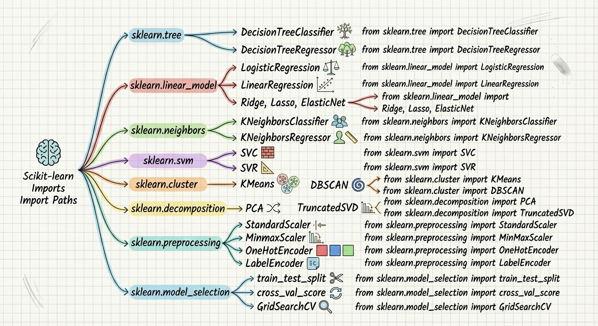
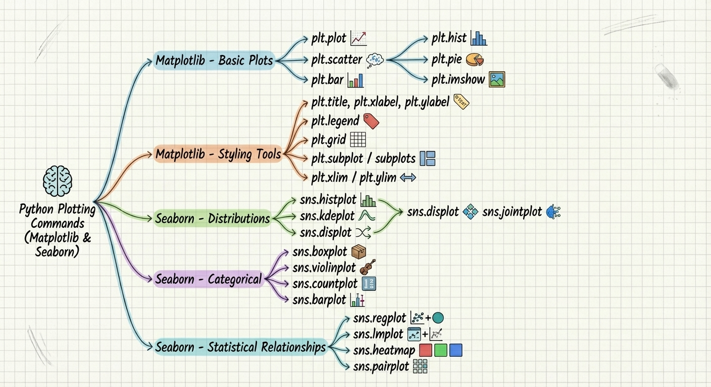

# End to End ML Life Cycle

## 📌 Project Overview

This project is designed as a **complete guide for beginners** to learn and implement the **entire Machine Learning lifecycle** using **real sales data**. It covers everything from **data collection** to **deployment on Streamlit**.

By the end of this project, you will be able to:

* Explore and clean a real sales dataset
* Perform exploratory data analysis (EDA)
* Select and engineer features for your model
* Train a machine learning model to predict sales
* Evaluate model performance
* Save and deploy the model using Streamlit

> **Note for beginners:** The goal is to make all steps simple and understandable, with explanations for terms that may be unfamiliar.

---

## 📂 Folder Structure

```
End to End ML Life Cycle/
│
├─ data/
│   └─ sales_data.csv          # Original sales data
│
├─ notebooks/
│   └─ EDA_and_Modeling.ipynb  # EDA and model training steps
│
├─ model/
│   └─ sales_model.pkl         # Trained model ready to use
│
├─ app/
│   └─ streamlit_app.py        # Interactive app for end users
│
├─ images/
│   ├─ ml_libraries_1.png
│   └─ ml_libraries_2.png
│
├─ requirements.txt            # Python libraries required
└─ README.md                   # This file
```

---

## 🛠 ML Lifecycle Steps

### 0️⃣ Required Libraries

Here’s a quick visual summary of the main Python libraries we need:




**Simple explanations for beginners:**

* `pandas` → for loading, cleaning, and manipulating data
* `numpy` → for numerical operations and arrays
* `matplotlib` / `seaborn` → for data visualization
* `scikit-learn` → for training ML models, preprocessing, and evaluation
* `pickle` → for saving and loading trained models
* `streamlit` → for creating interactive apps that anyone can use

> **Tip:** Each library has a specific role. For example, `scikit-learn` is the main library for machine learning in Python.

---

### 1️⃣ Data Collection

* The sales dataset is already included in the repository: `data/sales_data.csv`
* Load the dataset using Pandas:

```python
import pandas as pd
df = pd.read_csv("data/sales_data.csv")
df.head()  # Display the first 5 rows
```

**Explanation:**

* Each row represents a sale, and each column is a different piece of information such as product, price, quantity, region…
* `head()` is used to preview the data.

---

### 2️⃣ Data Cleaning & EDA (Exploratory Data Analysis)

* **Check for missing values** → look for blanks or nulls in the dataset
* **Remove duplicates** → eliminate repeated rows
* **Analyze key columns** → sales, categories, regions
* **Visualize trends** → use `matplotlib` and `seaborn` to see patterns

**Explanation:**

* EDA helps you understand your data before training the model.
* Visualizations make it easier to find relationships between features.

---

### 3️⃣ Feature Engineering

* **Encode categorical variables** → convert text categories into numbers (e.g., Category → Furniture, Technology…)
* **Select important features** → Quantity, Price, Region…
* **Optional:** Create new features (e.g., Profit = Price × Quantity)

**Explanation:**

* Feature = a column or characteristic used by the model.
* Models cannot work with text directly, so we convert them to numbers (One-Hot Encoding).

---

### 4️⃣ Model Training

* **Split data** into training and testing sets (`train_test_split`)
* **Choose a ML model** → e.g., `LinearRegression` or `DecisionTreeRegressor`
* **Train the model** on training data
* **Predict** on test data to see how well the model performs

**Explanation:**

* The model learns the relationship between features and sales.
* Test data = data the model hasn’t seen before, used to evaluate performance.

---

### 5️⃣ Model Evaluation

* Use **performance metrics** such as:

  * `MSE` → Mean Squared Error
  * `R²` → Coefficient of determination (how well predictions match real data)
* **Goal:** know how accurate the model is before deploying

---

### 6️⃣ Model Saving

* Save the trained model with `pickle` to avoid retraining every time:

```python
import pickle
pickle.dump((model, encoder), open("model/sales_model.pkl", "wb"))
```

> After saving, you can use the model directly in any app.

---

### 7️⃣ Deployment with Streamlit

* Create an interactive app (`streamlit_app.py`)
* Users input product details: quantity, discount, category, region…
* The app predicts sales using the saved model
* Display results in a **user-friendly interface**

```bash
streamlit run app/streamlit_app.py
```

**Explanation for beginners:**

* Streamlit makes your app **interactive and easy to use**.
* No programming skills are needed; just input the data and click Predict.

---

### 💡 Tips for Beginners

* Don’t worry if some terms are new:

  * **EDA** = Exploratory Data Analysis (understanding data)
  * **Feature Engineering** = preparing columns for the model
  * **Train/Test Split** = separating data to check model performance
  * **Deployment** = making your model usable by anyone

---
